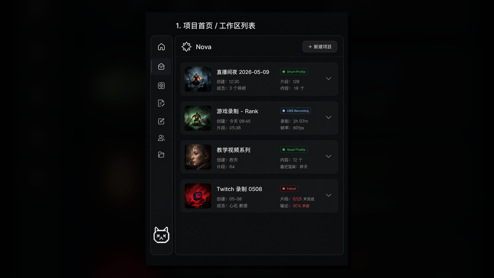
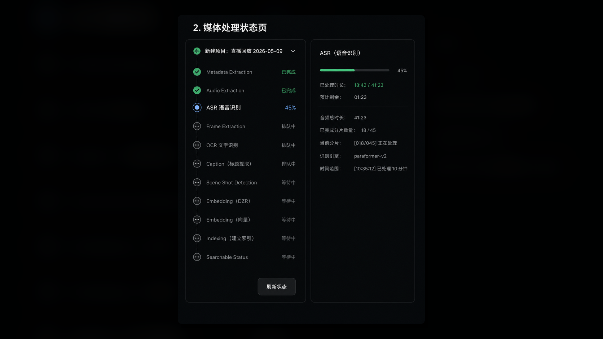
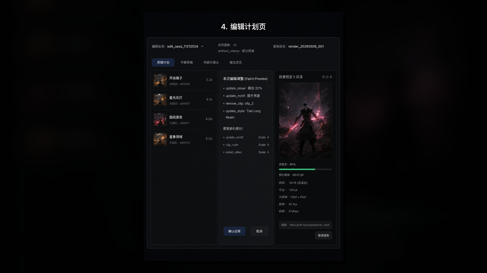
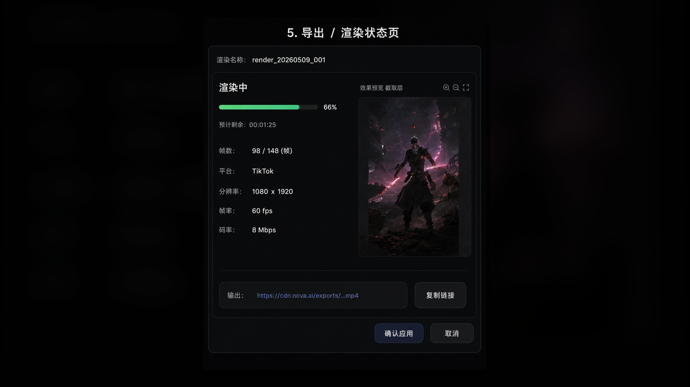

# CamCat

> 把一句剪辑想法，慢慢变成一条可以播放的视频。🎬

CamCat 是我的个人视频实验室。上传几段原片，写一句想要的效果，它会分析镜头、寻找合适素材、列出剪辑计划、生成字幕，再交给 FFmpeg 渲染成片。

如果你也对多模态检索、Agent 工作流或自动剪辑感兴趣，欢迎把它跑起来看看，欢迎带着新点子一起来玩～

## CamCat 会做这些事

- 建项目、上传原片，并在「媒体处理」页查看真实的处理任务和进度；
- 用文字或参考图描述剪辑目标，检索有来源和许可证记录的素材库内容；
- 生成可查看的剪辑计划、证据、节点轨迹、字幕和版本记录；
- 在时间线上排序、裁短、拆分片段，或回滚到前一个版本；
- 调用 FFmpeg 生成带字幕的视频，并在浏览器中播放、复制链接或下载；
- 连接阿里云百炼托管模型，让本机专心运行应用和媒体服务。

用户原片走四小时临时处理通道；授权素材库则保存来源 URL、许可信息和 Milvus 索引。两条通道各司其职。

## 界面预览

视频编辑主页保持三栏工作区。左侧四个图标会切换到项目列表、媒体处理、编辑计划和导出渲染；顶部和左侧导航始终保留，方便在同一项目里往返。

### 项目列表



项目卡片、会话和版本信息来自本地数据库。创建项目、展开会话、回到上次剪辑，都可以从这里开始。

### 媒体处理



上传后，Job 会一路汇报队列状态、重试次数、进度、媒体数和镜头数。FFprobe、场景切分、ASR、缩略图和质量分析的进展都集中在这一页。

### 编辑计划



这里汇集 Evidence、State、Trace、字幕、Audit Log 和多轨时间线。每次片段调整都会变成带版本号的 State Patch，刷新、比较和回滚都有迹可循。

### 导出渲染



渲染页显示 Worker 的真实状态、画幅、时长、字幕产物和 FFprobe 信息。完成后可以直接播放，或下载生成的文件。

## 五分钟跑起来

### 准备清单

- Docker Desktop（或 Docker Engine + Compose v2）；
- 一个可用的阿里云百炼工作空间和新的 API Key；
- 一个百炼能够访问的 HTTPS 对象存储地址，用于视频理解和视频 embedding；
- 可选的 `PIXABAY_API_KEY`，用于按关键词导入 Pixabay 授权视频。

### 配置百炼

先复制一份配置样例，密钥统一住在本机的 `.env` 里：

```bash
cp .env.example .env
```

至少填写下面两项：

```dotenv
CAMCAT_BAILIAN_API_HOST=https://<你的工作空间>.cn-beijing.maas.aliyuncs.com
CAMCAT_BAILIAN_API_KEY=<一枚新创建且仅供 CamCat 使用的 API Key>
```

`CAMCAT_BAILIAN_API_HOST` 的格式是工作空间根地址，例如 `https://<workspace>.cn-beijing.maas.aliyuncs.com`。模型对应的接口路径由 CamCat 适配器自动补齐。

本地单用户运行时，`CAMCAT_PROVIDER_GATEWAY_API_KEY` 可以留空，Compose 会准备一枚内部开发密钥。多人环境可以换成自己生成的网关密钥，配置方法见 [两种运行方式](#两种运行方式)。

API Key、`.env`、MinIO 密码和签名下载链接都适合留在本机；公开分享时使用新生成的专用密钥最省心。

### 启动

```bash
docker compose up --build
```

启动完成后可以打开：

- CamCat：<http://localhost:5173>
- API 文档：<http://localhost:5173/docs>
- API 就绪检查：<http://localhost:5173/health/ready>
- MinIO Console：<http://localhost:9001>

Compose 下 Web 使用同源 `/api` 代理，`VITE_CAMCAT_API_BASE` 保持为空即可。单独在 `apps/web` 目录运行 `npm run dev` 时，将它设成 `http://127.0.0.1:8000`。

### 第一次使用

1. 在项目列表新建一个项目。
2. 回到编辑工作区，点击 `Upload` 选择一段或几段原片。
3. 在媒体处理页等待任务完成。
4. 输入剪辑目标；也可以上传一张参考图。
5. 查看生成的素材证据、计划、字幕和时间线，按需要裁切、拆分、排序或回滚。
6. 点击 `Export`，在导出渲染页等待完成后播放或下载。

## 模型搭档

默认模型组合如下：

| 用途 | 默认模型 |
| --- | --- |
| 多模态 embedding | `Qwen/Qwen3-VL-Embedding-8B`（2048 维 MRL） |
| Rerank | `Qwen/Qwen3-VL-Reranker-8B` |
| 需求理解与视频分析 | `qwen3-vl-plus` |
| ASR | `qwen3-asr-flash` |

文本、图片和视频会进入同一套多模态 embedding 空间。视频会按 multipart 合同直接发送给 provider；检索会结合 Milvus 向量、BM25 和标签/事件等结构化条件，再做一次有界 rerank。请求和响应细节在 [provider-contract.md](docs/provider-contract.md)。

想给素材库添点内容，可以直接运行导入脚本。每条素材都会带上来源 URL 和许可证，视频会自动整理成 20 秒以内的片段。

```bash
# 导入少量公开的 Pixabay 视频
docker compose exec api python scripts/seed_open_library.py --count 2 --max-duration 20

# 可选：使用自己的 Pixabay Key 按关键词扩充
docker compose exec -e PIXABAY_API_KEY="$PIXABAY_API_KEY" api \
  python scripts/seed_open_library.py --query "travel nature city" --count 3
```

Pixabay 和 Mixkit 媒体沿用各自来源页面的许可证，仓库代码则使用 MIT 许可证。

## 两种运行方式

`local-single-user` 是默认选择，适合在自己的电脑上体验。所有数据统一归到 `CAMCAT_LOCAL_USER_ID`，开箱即可使用。

`multi-user` 适合继续扩展成共享服务。配置可信反向代理、`CAMCAT_TRUSTED_PROXY_SECRET`、`CAMCAT_LIBRARY_ADMIN_KEY` 和专用的 `CAMCAT_PROVIDER_GATEWAY_API_KEY`，再搭配 TLS、私有网络和独立数据库凭据即可。

上传入口会检查 MIME、文件大小、用户配额和 ffprobe 信息。Nginx 提供 CSP、基础安全响应头、请求体控制、限流与同源 API 代理。更多部署细节都放在 [docs](docs) 中。

### 百炼连接小贴士

让 gateway 顺利找到百炼工作空间，只需要确认三件事：

1. Host 使用百炼工作空间根地址；
2. `.env` 使用当前有效的专用 Key；
3. 更新配置后刷新三个服务：

   ```bash
   docker compose restart api worker provider-gateway
   ```

Docker 容器从项目 `.env` 读取 Host 和 Key；Bailian CLI 的 `~/.bailian/config.json` 则继续服务于命令行工具。

## 开发者角落

开发环境固定为 Python 3.12：

```bash
python3.12 -m venv .venv
.venv/bin/pip install -e '.[dev]'
cd apps/web && npm ci && cd ../..
```

检查命令：

```bash
make test                 # 格式、类型、API 合同、单元/前端测试和 Web 构建
make test-integration     # PostgreSQL、Milvus、MinIO、FFmpeg 与迁移
make test-external        # 真实 embedding、rerank、VL 和 ASR（需要凭据）
make e2e                  # Playwright 浏览器流程（需要测试媒体）
```

为 `make test-external` 配置 `CAMCAT_EXTERNAL_TEST_VIDEO`；为 `make e2e` 配置 `CAMCAT_E2E_VIDEO` 和 `CAMCAT_E2E_IMAGE`，就能跑完整的媒体与浏览器旅程。

```text
apps/api/          FastAPI、LangGraph、Worker、FFmpeg 和 provider gateway
apps/web/          React/Vite/TypeScript 前端
packages/contracts OpenAPI 生成/共享类型
tests/integration/ 外部服务与媒体链路检查
tests/e2e/         浏览器流程
infra/             Compose 与启动配置
docs/              架构、协议、运维和素材许可记录
```

[AGENTS.md](AGENTS.md) 写好了工程约定和 [docs/architecture.md](docs/architecture.md) 的数据流～

导入媒体的来源与许可记录在 [docs/media-licenses.json](docs/media-licenses.json) 和 [docs/open-audio-library.json](docs/open-audio-library.json)。
