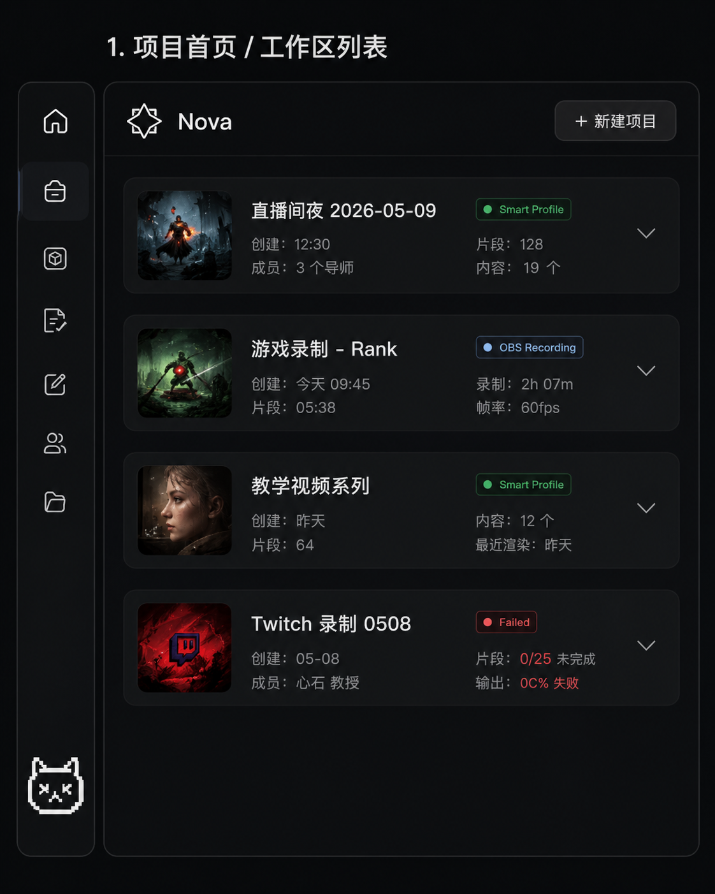
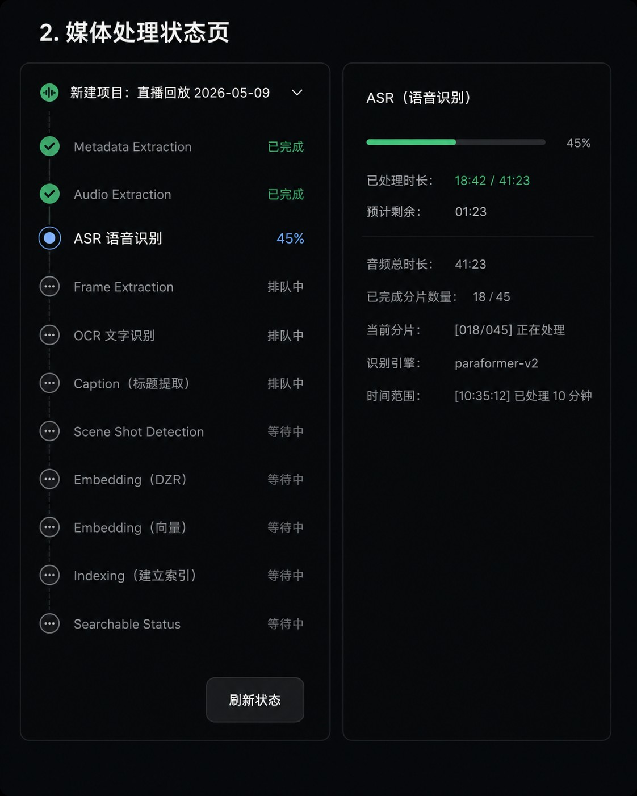
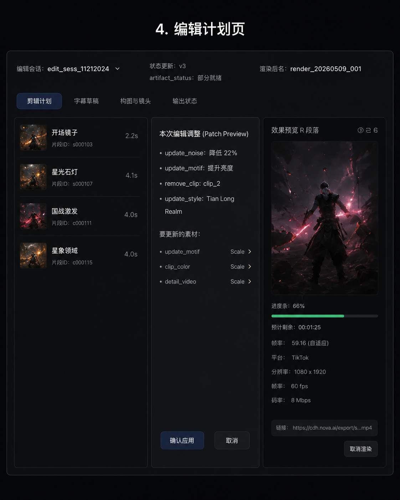
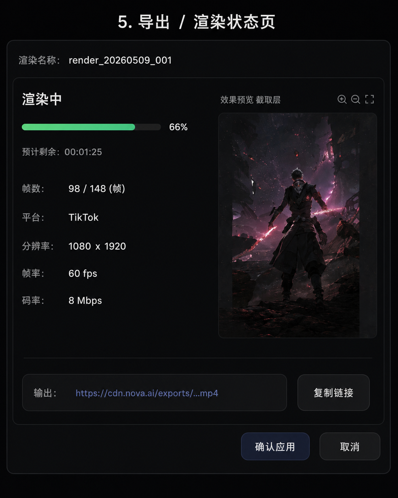

# CamCat

CamCat 是一个可通过 Docker Compose 本地运行的多模态智能视频剪辑工作台。用户上传原片、用文本或参考图描述发布目标，CamCat 从用户原片和有授权的素材库中选片，通过 LangGraph 生成可审计的剪辑计划，最后使用真实 FFmpeg 生成含字幕的可播放视频。

本仓库不在生产、集成或 E2E 链路中使用随机向量、假模型响应或静态成功数据。缺少必需凭据时会明确失败，不会悄悄降级成 mock provider。

## 产品界面

生产前端保留 `nova-front` 的布局、间距、颜色、字体与交互模型，只替换为 CamCat 品牌并接入真实 API。以下设计渲染图作为界面验收基准，保留在仓库中便于开源贡献者对照。

视频编辑主页保持原有三栏工作区；最左侧四个图标分别进入项目列表、媒体处理、编辑计划和导出渲染。三个辅助页面与项目列表使用统一内容宽度，宽屏下靠左显示并在右侧自然留黑，避免拉伸设计稿。

### 1. 项目列表



项目、剪辑会话、版本号和片段数都来自 PostgreSQL。可创建项目、展开会话、恢复剪辑或软删除会话，不再展示静态样例卡片。

### 2. 媒体处理



上传后进入独立处理页，展示真实 Job ID、队列状态、重试次数、进度、媒体数和镜头数。原片仅保留四小时，只做 FFprobe、场景切分、ASR、缩略图、质量与镜头分析；不创建长期 `Asset`/`Segment`，不写入 Milvus。

### 3. 编辑计划



工作区中的 Evidence、State、Trace、Artifacts、字幕、Audit Log 和多轨时间线均使用后端数据。片段支持拖拽排序、裁短和中点拆分；所有变更通过 `base_version` 和 RFC 6902 风格 State Patch 持久化。

### 4. 导出渲染



渲染页跟踪真实 Worker 进度，展示状态版本、画幅、时长、字幕产物和 FFprobe 结果。成功后可直接播放、复制短时签名链接，或使用带 `Content-Disposition: attachment` 的专用 URL 下载。

## 完整工作流

```text
用户原片（4 小时临时）  授权素材库（长期）
        │                         │
        ├─ 镜头/质量/ASR         ├─ Qwen3-VL 视频 embedding
        │                         └─ Milvus dense + BM25 + scalar
        └───────────────────────────┐
                                  │
                  LangGraph 理解/规划/检索/剪辑/字幕
                                  │
                  State Patch + 乐观锁 + Audit Log
                                  │
                         FFmpeg 渲染 + MinIO
```

### 主要能力

- Qwen3-VL-Embedding-8B 使用 2048 维 MRL 输出；文本、图片和原视频进入同一多模态语义空间。
- 视频通过唯一 multipart `/v1/embeddings` 合同上传；不抽三帧、不平均多个向量、不用 caption-only 替代视觉 embedding。
- Milvus HNSW 稠密召回、原生 BM25 稀疏召回和标签/事件/风险结构化召回并行执行，保留每路分数与排名证据。
- 加权 RRF 与确定性业务打分后，使用 Qwen3-VL-Reranker 对有界候选集执行真实多模态重排。
- LangGraph 拆分需求理解、查询规划、素材检索、剪辑计划、字幕、验证和持久化节点，通过 SSE 推送进度，并保留轮询恢复。
- PostgreSQL 保存项目、剪辑会话、Graph Run、节点 Trace、版本、Patch、Job 和审计事件。
- `base_version` Compare-and-Swap 乐观锁、HTTP 409 冲突元数据和补偿式回滚，不覆盖新版本。
- Worker 使用真实 FFmpeg/ffprobe 完成五种画幅、基础调色、字幕边距和 -14 LUFS 规范化。
- PostgreSQL Job 具备 lease、heartbeat、超时重领、重试/退避、取消、dead-letter 和 checkpoint。
- MinIO lifecycle 是临时对象删除的真相源；本地 `runtime/jobs` 在 `finally` 中删除，数据库在精确四小时边界脱敏。

## 所需 API 与部署答案

### 需要自己部署模型吗？

不需要。默认开源配置直接调用阿里云百炼托管 API，本地不需要 GPU、vLLM 或模型权重。Compose 中的 `provider-gateway` 只是轻量适配器：它把 CamCat 稳定的 provider 合同转换成百炼接口，不运行模型。

### API 清单

| 配置 | 是否必需 | 用途 |
| --- | --- | --- |
| `CAMCAT_BAILIAN_API_HOST` | 必需 | 百炼工作空间根地址，如 `https://<workspace>.cn-beijing.maas.aliyuncs.com` |
| `CAMCAT_BAILIAN_API_KEY` | 必需 | 调用 Qwen embedding、reranker、VL 理解和 ASR |
| `CAMCAT_PROVIDER_GATEWAY_API_KEY` | 本地单用户可选；多用户必需 | Compose 内 API/Worker 访问适配器的共享密钥，不是百炼 key。省略时仅本地单用户栈使用受限的内部默认值 |
| `CAMCAT_OBJECT_STORE_PUBLIC_ENDPOINT` | 完整视频链路必需 | 百炼可访问的 HTTPS MinIO/S3 地址，用于短时签名视频 URL |
| `PIXABAY_API_KEY` | 可选 | 按关键词搜索并导入 Pixabay 授权视频 |

当前默认模型：

- embedding：`Qwen/Qwen3-VL-Embedding-8B`，MRL 固定为 2048 维；
- reranker：`Qwen/Qwen3-VL-Reranker-8B`；
- 需求理解/视频结构化分析：`qwen3-vl-plus`；
- ASR：`qwen3-asr-flash`。

百炼官方文档：[Multimodal Embedding API](https://help.aliyun.com/en/model-studio/multimodal-embedding-api-reference)、[Text/Multimodal Rerank API](https://help.aliyun.com/en/model-studio/text-rerank-api)。CamCat 的精确请求与响应合同见 [docs/provider-contract.md](docs/provider-contract.md)。

### 安全配置 API Key

1. 复制示例，`.env` 已被 Git 忽略：

   ```bash
   cp .env.example .env
   ```

2. 在 `.env` 中填写百炼工作空间根地址。不要加 `/compatible-mode/v1` 或 `/api/v1`，适配器会根据模型选择路径。
3. 新建一枚未曝光的百炼 API Key，写入 `CAMCAT_BAILIAN_API_KEY`。任何曾经粘贴到聊天、Issue、日志或截图中的 key 都应立即撤销并重新生成。
4. 本地单用户开发可跳过 `CAMCAT_PROVIDER_GATEWAY_API_KEY` 及四个内部 `*_API_KEY`；它们会在仅限 Compose 私网的适配器中使用同一个本地默认值。若启用 `multi-user`，必须生成内部网关密钥：

   ```bash
   openssl rand -hex 32
   ```

   将结果写入 `CAMCAT_PROVIDER_GATEWAY_API_KEY`；其余四个内部 `*_API_KEY` 留空即可继承它。
5. 如果要调用百炼视频 embedding/理解，将 MinIO 通过受控 HTTPS 反向代理或隧道暴露，并把公网根地址写入 `CAMCAT_OBJECT_STORE_PUBLIC_ENDPOINT`。只暴露对象端点，不要暴露 MinIO Console。

请勿把 `.env`、API Key、MinIO 密码或签名 URL 提交到 Git。

## 快速启动

### 前置条件

- Docker Desktop 或 Docker Engine + Compose v2；
- 可用的百炼工作空间和新 API Key；
- 完整视频 provider 验收时，需要百炼可访问的 HTTPS 对象存储地址。

### 启动 Compose

```bash
cp .env.example .env
# 编辑 .env，替换所有 change-me
docker compose up --build
```

启动后：

- CamCat Web：<http://localhost:5173>
- FastAPI OpenAPI：<http://localhost:5173/docs>
- API readiness：<http://localhost:5173/health/ready>
- MinIO Console：<http://localhost:9001>

Compose Web 默认使用 Nginx 同源 `/api` 代理，因此 `VITE_CAMCAT_API_BASE` 保持空值。只有在 `apps/web` 外置运行 `npm run dev` 时才需要将它设为 `http://127.0.0.1:8000`。

### 首次使用

1. 打开项目列表，创建一个项目。
2. 在工作区点击 `Upload`，选择 1–20 个原片。
3. 在媒体处理页等待任务完成，然后进入编辑计划。
4. 输入发布目标，可选上传参考图；Agent 通过一次 Graph Run 完成理解、检索和计划，不重复跑两套检索。
5. 审阅 Evidence、Trace、字幕、Audit Log 和时间线，必要时裁切、拆分、拖拽或回滚。
6. 点击 `Export`，在渲染页查看进度，完成后播放或下载。

## 导入授权素材

默认导入脚本使用 Pixabay 开放视频和 Mixkit 免费音频，每个长期素材都必须保存来源 URL 和许可证。视频默认裁成不超过 20 秒。

```bash
# 使用 Pixabay API 文档公开的真实短样片
docker compose exec api python scripts/seed_open_library.py --count 2 --max-duration 20

# 可选：使用自己的 Pixabay key 按关键词扩充
docker compose exec -e PIXABAY_API_KEY="$PIXABAY_API_KEY" api \
  python scripts/seed_open_library.py --query "travel nature city" --count 3
```

`PIXABAY_API_KEY` 不得由浏览器提交，长期素材 import 在 `multi-user` 模式下还需要管理员密钥。

## 安全模式

- `local-single-user`：默认开源演示模式。服务器忽略浏览器伪造的 `X-User-Id`，所有数据绑定到 `CAMCAT_LOCAL_USER_ID`。
- `multi-user`：只信任经过身份验证的反向代理头，必须配置 `CAMCAT_TRUSTED_PROXY_SECRET` 和 `CAMCAT_LIBRARY_ADMIN_KEY`。生产部署还应使用 TLS、私有网络、独立数据库凭据和集中密钥管理。

`multi-user` 还必须配置非默认的 `CAMCAT_PROVIDER_GATEWAY_API_KEY`。默认 gateway 端口只绑定到 `127.0.0.1`；不要把它暴露到公网。

`camcat_segments_v7` 是当前 Milvus collection。它与旧 collection 不兼容时会新建索引而不删除旧数据；若要保留既有素材，请用新的 v7 collection 重新执行授权素材摄取。

Nginx 已配置 CSP、`nosniff`、Referrer Policy、Permissions Policy、请求体上限、API 限流和同源代理。上传还会执行 MIME、文件大小、用户配额和 ffprobe 校验。

### 百炼连接错误

若 UI 显示 `Bailian transport failure: ConnectError` 或 502，通常表示 gateway 到百炼工作空间的 DNS/网络连接失败，而非剪辑本身失败。确认 `CAMCAT_BAILIAN_API_HOST` 是工作空间根地址（不要附加 `/compatible-mode/v1` 或 `/api/v1`）、API Key 已轮换且有效，然后重启 `api`、`worker` 和 `provider-gateway`。`~/.bailian/config.json` 不会自动注入 Docker Compose，仍需要在项目 `.env` 中配置这两个百炼变量。

## 开发与验证

Python 运行时固定为 3.12。

```bash
python3.12 -m venv .venv
.venv/bin/pip install -e '.[dev]'
cd apps/web && npm ci && cd ../..
```

```bash
make test                 # Ruff、Mypy、OpenAPI 合同、单元/前端测试和生产构建
make test-integration     # 真实 PostgreSQL、Milvus、MinIO、FFmpeg 与迁移验证
make test-external        # 真实文本/图片/视频 embedding、rerank、VL 与 ASR
make e2e                  # Playwright 全链路浏览器旅程
```

外部 provider 测试需要 `CAMCAT_EXTERNAL_TEST_VIDEO`；Playwright 需要 `CAMCAT_E2E_VIDEO` 和 `CAMCAT_E2E_IMAGE`。缺少时测试会以明确原因 skip，不会伪造通过。

### 本地浏览器验收记录

当前四页已在真实 Compose 栈上逐项点击验证：项目创建/列表/恢复、原片上传与 Job 进度、编辑标签与时间线、导出进度、成片播放、复制链接和下载。完成裁短与 State Patch 后，验收样片通过真实 FFmpeg 生成 1920×1080、2.03 秒、字幕已烧录的 MP4；浏览器确认成片 `<video>` 可加载，并成功触发下载事件。

这一记录只代表本地 PostgreSQL/MinIO/Worker/FFmpeg 链路；未使用有效、未曝光的百炼 key 时，不声明外部模型合同或完整 Agent E2E 通过。

## MVP 能力边界

下列能力已经接入真实媒体链路，但当前仍是可用 MVP，README 不将它们夸大为专业 NLE 完整实现：

- 镜头去重是 JPEG SHA-256，尚非感知哈希；
- 质量信号主要来自 `blurdetect`，分析失败时使用保守默认值；
- 转场为单片段淡入淡出，尚非 clip-to-clip `xfade`；
- 背景音乐使用固定音量 `amix`，尚无 sidechain ducking；
- SFX 只使用首条并在 650ms 播放一次；
- ASR 有时间戳时字幕严格对齐，无时间戳时由 LLM 生成；
- 安全区当前主要是固定字幕边距；
- 时间线支持排序、裁短和拆分，但尚不是帧级多轨专业编辑器。

## 仓库结构

```text
apps/api/          FastAPI、LangGraph、Worker、FFmpeg 和 provider gateway
apps/web/          React/Vite/TypeScript、Nova 衍生的 CamCat 前端
packages/contracts OpenAPI 生成/共享合同
tests/integration/ PostgreSQL、Milvus、MinIO、Provider、FFmpeg 集成验证
tests/e2e/         全链路浏览器旅程
infra/             Compose 配置与启动资源
docs/              架构、Provider 合同、运维和素材授权
```

关键入口：

- `apps/api/camcat/api.py`：FastAPI 合同、错误包装和产品 API；
- `apps/api/camcat/worker.py`：临时原片分析、长期素材摄取和成片渲染；
- `apps/api/camcat/agent/graph.py`：LangGraph 多节点剪辑流程；
- `apps/api/camcat/retrieval/`：Milvus 多路召回、融合、业务打分与重排；
- `apps/api/camcat/domain/state_patch.py`：Patch 校验、乐观锁和回滚；
- `apps/web/CamCatApp.tsx`：项目列表与页面路由；
- `apps/web/CamCatWorkspacePage.tsx`：媒体处理、编辑计划和导出渲染；
- `apps/web/e2e/camcat.spec.ts`：真实浏览器 E2E。

详细工程合同与验收门槛见 [AGENTS.md](AGENTS.md)；整体数据流见 [docs/architecture.md](docs/architecture.md)。

## 开源许可

代码使用 [MIT License](LICENSE)。通过 Pixabay/Mixkit 导入的媒体仍遵循各自来源页和许可证，不因仓库的 MIT 许可而改变。记录见 [docs/media-licenses.json](docs/media-licenses.json) 和 [docs/open-audio-library.json](docs/open-audio-library.json)。
