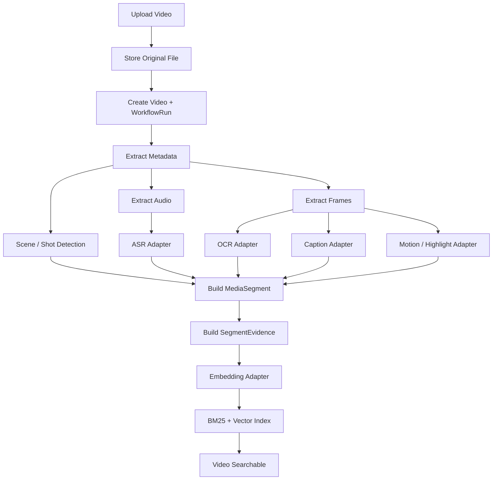

# 系统架构

## 高层架构

Nova Agent Platform 的目标架构采用 LangGraph 的 Agentic Workflow 编排方式；Phase 1/2 保留 deterministic local implementation 作为可测试垂直切片，Phase 3 将 /api/v1/search/agentic 迁移到 LangGraph StateGraph。系统以 LangGraph 作为 Agent Orchestration Layer，把视频理解、混合检索、重排、证据校验和创作建议封装为可编排 nodes/tools。

```text
Nova Agent Platform
├── API Layer: FastAPI
├── Agent Orchestration Layer: LangGraph
│   ├── AgentState
│   ├── StateGraph
│   ├── QueryRewriteNode
│   ├── RetrievalNode
│   ├── RerankNode
│   ├── CreativeSuggestionNode
│   ├── ReflectionNode
│   ├── FinalAnswerNode
│   └── Checkpointer / Trace
├── Multimodal Pipeline
│   ├── ASR Adapter
│   ├── OCR Adapter
│   ├── Caption Adapter
│   ├── Embedding Adapter
│   └── Scene / Shot Adapter
├── Retrieval Engine
│   ├── BM25
│   ├── Dense Retrieval
│   ├── Metadata Filtering
│   ├── Hybrid Fusion
│   └── Rerank
├── Workflow / Async Layer
│   ├── LangGraph for Agent Workflow
│   └── Celery / Redis for heavy media jobs later
└── Storage Layer
    ├── Metadata DB
    ├── Object Storage
    └── Vector DB
```

LangGraph 的职责是 Agent workflow orchestration；它不替代多模态处理、检索引擎、对象存储、向量库或重型异步任务队列。

## 核心架构原则

* LangGraph 是 Agentic Search 的 orchestration backbone，负责 AgentState、StateGraph、node execution、checkpoint、trace 与 reflection。
* Retrieval、Rerank、Creative Suggestion、Evidence Grounding 都应作为 LangGraph nodes/tools 被编排。
* MediaSegment 是视频业务场景下的标准化数据对象，用于在各 nodes/tools 之间传递片段、证据和分数。
* LangGraph node 应保持 thin orchestration，不在 node 内重复实现 retrieval / media pipeline 业务逻辑。
* `AgentState` 是 LangGraph 执行时状态载体，保存 query、rewrite、retrieved/reranked segments、creative suggestions、reflection result、final answer、node trace。
* 每个 LangGraph node 应是可测试的 thin orchestration unit：读取/更新 AgentState，调用现有 retrieval/media/suggestion 服务，并避免在 node 内复制业务逻辑。
* `POST /api/v1/search` 保持普通检索兼容。
* `POST /api/v1/search/agentic` 由 LangGraph workflow 执行。
* 重型视频处理后续交给 Celery/Redis；Agent workflow 不负责跑长耗时媒体任务，只调度和消费结果。

## Agent Orchestration Layer

LangGraph graph：

```text
START
→ QueryRewriteNode
→ RetrievalNode
→ RerankNode
→ CreativeSuggestionNode
→ ReflectionNode
→ FinalAnswerNode
→ END
```

`AgentState` 建议字段：

* `graph_run_id`
* `thread_id`
* `user_id`
* `session_id`
* `query_text`
* `rewritten_query`
* `expanded_queries`
* `filters`
* `retrieved_segments`
* `reranked_segments`
* `creative_suggestions`
* `reflection_result`
* `final_answer`
* `node_trace`
* `errors`

Node 职责：

* `QueryRewriteNode`：中文创意查询改写与意图扩展。
* `RetrievalNode`：调用 Retrieval Engine，执行 BM25、dense、metadata filtering、hybrid fusion。
* `RerankNode`：调用 rule/model reranker，融合 relevance、motion_score、highlight_score、tag match。
* `CreativeSuggestionNode`：生成 BGM、转场、剪辑 notes、标题或封面文案。
* `ReflectionNode`：校验时间戳、证据、理由、答案完整性，不做复杂自主修复。
* `FinalAnswerNode`：生成结构化 answer，必须基于 `SegmentEvidence`。

## Upload-to-Index Pipeline



MVP 默认 deterministic mock adapters。真实 FFmpeg、Whisper、PaddleOCR、caption model、embedding model 和 PySceneDetect 通过 adapter 引入，不能成为默认测试阻塞项。

## Search-to-Answer Pipeline

普通搜索：

```text
SearchQuery
→ Query Rewrite
→ Hybrid Retrieval
→ Rerank
→ Evidence Grounding
→ Search Response
```

Agentic Search：

```text
POST /api/v1/search/agentic
→ create AgentState
→ run LangGraph StateGraph
→ persist or return state_snapshot
→ return node_trace + ranked_segments + final_answer
```

示例 query：

```text
帮我找适合做热血卡点的视频素材
```

应扩展为：

```text
热血 / 燃系 / 高能 / 快节奏 / 镜头切换明显 / 动作强 / beat 匹配 / 团战 / 冲刺 / 反击 / 高潮片段
```

## Workflow / Async Layer

* LangGraph：用于 Agent search workflow、state transition、trace、checkpoint、thread continuation。
* Celery/Redis：用于后续重型媒体任务，例如抽帧、ASR、OCR、embedding、批量直播分析。
* MVP 可以同步或本地执行 mock pipeline，但文档和模块边界必须为 Celery/Redis 留出位置。

## Storage Layer

* Metadata DB：保存 `Video`、`MediaSegment`、`SegmentEvidence`、`WorkflowRun`、`AgentRun`、`GraphRun`。
* Object Storage：保存原视频、音频、关键帧、缩略图、预览切片。
* Vector DB：后续保存 text/visual/multimodal embeddings；MVP 可用 in-memory adapter。
* Cache：Redis 后续用于 session、checkpoint、retrieval cache、embedding cache。

## 可观测性范围

MVP 不建设完整 dashboard，但必须支持：

* basic structured logs。
* `graph_run_id`、`thread_id`、`node_trace`。
* retrieval latency records。
* reflection issue records。
* benchmark hooks。
* simple evaluation scripts。

后续生产化再引入 Prometheus、Grafana、OpenTelemetry。
