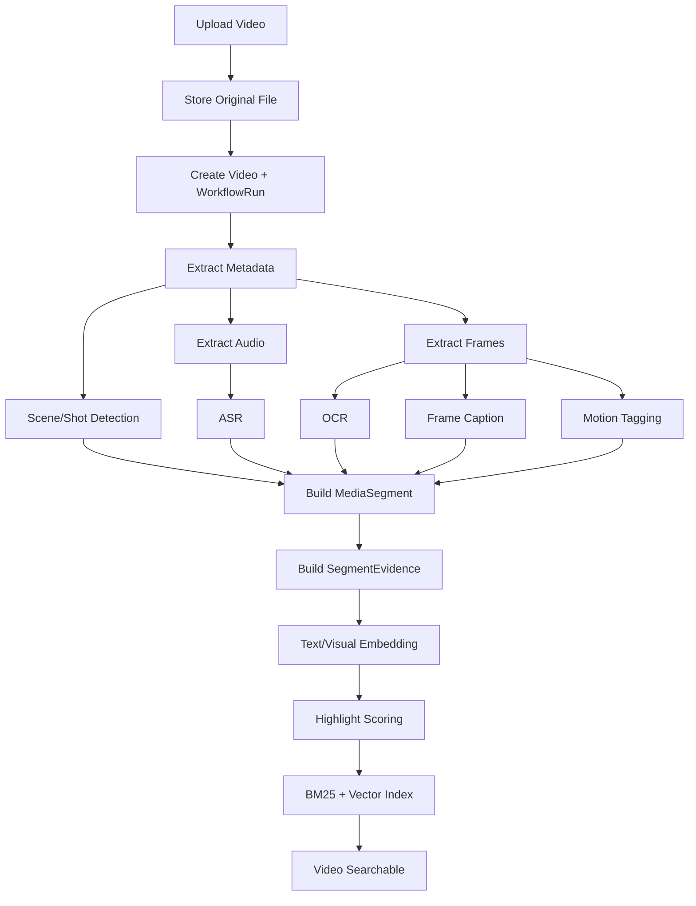

# 系统架构

## 高层架构

Nova Agent Platform 采用 Python-first、模块化、微服务友好的架构。MVP 阶段不拆成大量微服务，而是在一个 backend repo 内保持清晰模块边界，后续根据性能瓶颈、团队协作、部署规模与服务治理需求再逐步拆分。

系统采用 **Media Segment-first Architecture**。平台的核心处理对象不是完整视频文件，而是可检索、可解释、可重排、可创作的 `MediaSegment`。ASR、OCR、Frame Caption、Scene/Shot Detection、Embedding、Highlight Scoring、Agent Reasoning 都围绕片段级数据展开。

整体分为三层：

* Agent Runtime Platform

  * `Planner`
  * `Query Rewrite`
  * `Tool Registry`
  * `Tool Calling`
  * `Memory`
  * `Reflection`
  * `Model Gateway`
* Retrieval Engine

  * `BM25`
  * `Dense Retrieval`
  * `Hybrid Search`
  * `Metadata Filtering`
  * `Multimodal Fusion`
  * `Rerank`
  * `Evidence Grounding`
* Workflow Engine

  * `DAG`
  * `Async Queue`
  * `Task Orchestration`
  * `Retry`
  * `Task Status Tracking`
  * `Idempotent Task Execution`
* Multimodal Understanding

  * `ASR`
  * `OCR`
  * `Scene Detection`
  * `Shot Detection`
  * `Frame Caption`
  * `Motion Tagging`
  * `Text Embedding`
  * `Visual Embedding`
  * `Highlight Scoring`

系统上层提供两个应用场景：

* ToC：AI Content Search Assistant，用于视频素材搜索、高光定位、BGM 推荐、转场建议与剪辑脚本生成。
* ToB：AI Media Workflow Copilot，用于直播录屏分析、商品识别、高转化切片生成、自动分类、自动打 Tag 与摘要生成。

## MVP 服务组成

* Next.js frontend：上传、处理进度、搜索、片段详情、时间轴预览、Agent 生成结果展示。
* FastAPI backend：REST API、SSE streaming、session/user context、workflow 触发、search orchestration、Agent orchestration。
* Celery workers：异步媒体处理、特征提取、索引构建、批量 workflow task 执行。
* Redis：Celery broker、workflow status projection、session cache、embedding/retrieval cache 的热数据。
* PostgreSQL：`Video`、`MediaSegment`、`SegmentEvidence`、`WorkflowRun`、`WorkflowTask`、`SearchQuery`、`RetrievalResult`、`AgentRun` 等结构化数据。
* MinIO：原始视频、抽取帧、音频、缩略图、临时文件与中间产物。
* Milvus preferred / Qdrant acceptable：向量检索，存储 text embedding、visual embedding 与 segment-level metadata。
* Python BM25 / lightweight lexical index：MVP 的 lexical retrieval。OpenSearch 是未来替换选项，不是 MVP 必需组件。
* Model Gateway：统一封装 LLM、Embedding、Caption、Rerank 等模型调用。MVP 可先使用 mock adapter 或 API adapter，后续接入 vLLM / SGLang。
* Evaluation scripts：用于离线计算 recall@k、nDCG、MRR、segment retrieval accuracy、highlight hit rate 与 latency。

MVP 不要求一开始完成完整微服务拆分。建议先在单体 backend 中按模块隔离：

* `app/api`
* `app/domain`
* `app/workflow`
* `app/media`
* `app/retrieval`
* `app/agent`
* `app/models`
* `app/storage`
* `app/evaluation`

后续可将 retrieval、media pipeline、agent runtime、model serving 独立为服务。

## 平台要求

### 多用户 Session

所有外部可见记录都应包含 `user_id`。交互式搜索与 Agent 调用应包含 `session_id`。MVP 可以使用简单开发态认证，但模块接口必须传递 user/session context，避免未来接入权限、组织、素材库隔离与审计时改动领域模型。

需要重点保证：

* 用户只能检索自己有权限访问的视频与片段。
* `SearchQuery`、`AgentRun`、`WorkflowRun` 必须关联 `user_id` 与 `session_id`。
* 检索缓存必须包含权限上下文，不能跨用户错误复用。
* 后续 ToB 场景应预留 `org_id`、`workspace_id`、`asset_library_id` 等扩展字段。

### Streaming Response

基础搜索先返回结构化 JSON。Agent 生成过程可通过 `POST /api/v1/search/stream` 使用 Server-Sent Events 输出：

* `search_created`
* `query_rewrite_started`
* `query_rewrite_completed`
* `retrieval_started`
* `candidate_found`
* `rerank_completed`
* `agent_token`
* `agent_completed`
* `error`

Streaming 只负责改善交互体验，不应改变核心业务状态。完整结果仍需落库到 `SearchQuery`、`RetrievalResult` 与 `AgentRun`，便于复盘、评估与调试。

### 多级缓存

缓存边界应从 Phase 0 明确：

* Redis cache：session state、workflow progress、hot segment detail、短 TTL API response。
* Embedding cache：基于 content hash 缓存 text/visual embeddings。
* Retrieval cache：基于 `user_id`、`query_text`、filters、retrieval mode、index version 的候选结果缓存。
* Agent cache：可缓存 query rewrite 与部分稳定的 creative suggestion，但必须保留 evidence grounding 校验。
* Media artifact cache：缓存缩略图、关键帧、音频切片与低清预览文件路径。

缓存失效原则：

* 当同用户或同素材库新增索引片段时，相关 retrieval cache 失效。
* 当某个视频重新处理时，该视频下所有 segment 相关 cache 失效。
* 当模型版本、embedding 版本、rerank 策略变更时，需要通过 `index_version` 或 `model_version` 隔离旧缓存。

MVP 先实现稳定 cache key 设计与 Redis wrapper，复杂缓存策略后置。

### 可观测性范围

MVP 不建设完整 Prometheus/Grafana/OpenTelemetry dashboard。但必须包含：

* basic structured logs。
* workflow status tracking。
* task error metadata。
* task attempt records。
* retrieval latency records。
* agent step latency records。
* model adapter latency records。
* benchmark hooks。
* simple evaluation scripts。

后续生产化阶段补充：

* Prometheus metrics。
* Grafana dashboard。
* OpenTelemetry tracing。
* worker queue backlog monitoring。
* P95 / P99 latency dashboard。
* GPU utilization monitoring。
* cache hit rate monitoring。

## Upload-to-Index Pipeline



关键原则：

* 长视频必须被转换成可搜索、可解释、可复用、可创作的 `MediaSegment`。
* `MediaSegment` 是检索、重排、解释、剪辑建议与 ToB 自动切片的统一数据单元。
* ASR、OCR、Frame Caption、Motion Tagging 的结果都需要通过时间戳对齐到 segment。
* `Scene/Shot Detection` 负责提供初始片段边界；ASR 句子时间戳、镜头切换点、固定窗口策略可共同参与边界修正。
* `SegmentEvidence` 用于保存片段推荐理由所依据的真实证据，例如 ASR 命中文本、OCR 命中文本、caption 描述、tag、motion score、highlight score。
* 默认使用 deterministic mock adapters，真实 ASR/OCR/Caption/Embedding 作为 adapter 后续启用。
* 每个 workflow task 持久化状态、输入、输出、错误与 attempt。
* 每个 workflow task 应尽量幂等，重复执行不应产生重复 segment、重复索引或不可恢复的脏数据。
* 索引写入需要记录 `index_version`、`embedding_model`、`embedding_version` 与 `created_at`，便于后续重建索引和离线评估。

MVP 阶段可以先支持短视频或较短直播片段，不要求一开始处理超长直播回放。长视频、分布式处理、断点续跑和 GPU worker 调度可后置。

## Agentic Search Pipeline

创意搜索请求必须采用 Agentic Search，而不是单次关键词搜索。

```text
User Query
→ Query Rewrite
→ Query Plan
→ Multi-hop Retrieval
→ Hybrid Fusion
→ Rerank
→ Evidence Grounding
→ Creative Suggestion
→ Optional Reflection
→ Structured Answer
```

示例输入：

```text
帮我找适合做热血卡点的视频素材
```

`Query Rewrite` 应把意图扩展为：

* 热血
* 燃系
* 高能
* 快节奏
* 镜头切换明显
* 动作强
* beat 匹配
* 团战
* 冲刺
* 反击
* 高潮片段

`Query Plan` 应将用户请求转换为结构化检索计划，例如：

```json
{
  "intent": "creative_material_search",
  "style": ["热血", "燃系", "高能"],
  "tempo": "fast",
  "motion_intensity": "high",
  "shot_change_frequency": "high",
  "retrieval_channels": ["asr", "ocr", "caption", "tag", "text_embedding", "visual_embedding"],
  "expected_outputs": ["segments", "timestamps", "reasons", "bgm_style", "transition_suggestion", "script"]
}
```

`Multi-hop Retrieval` 应分别覆盖 ASR、OCR、frame captions、tags、text embeddings、visual embeddings 与 metadata filters。不同通道返回的候选结果需要统一映射到 `MediaSegment`。

`Hybrid Fusion` 应合并多路召回结果，并保留每个候选片段的召回来源、原始分数与证据来源。

`Rerank` 应综合以下信号：

* text relevance。
* visual relevance。
* BM25 score。
* dense retrieval score。
* `highlight_score`。
* `motion_score`。
* shot change frequency。
* tag match。
* metadata match。
* user/session preference。
* content popularity or business priority。

`Evidence Grounding` 必须保证推荐理由只引用实际存在的证据，不能编造。所有推荐理由都应能追溯到 `SegmentEvidence`。

`Creative Suggestion` 可以生成：

* 推荐 BGM 风格。
* BPM 范围。
* 转场建议。
* 开头字幕建议。
* 剪辑节奏建议。
* 片段组合顺序。
* 简短分镜脚本。

`Reflection` 用于检查：

* 是否缺少时间戳。
* 是否缺少推荐理由。
* 推荐理由是否没有证据支撑。
* 是否返回了整段视频而不是片段。
* 是否没有满足用户的创作意图。
* 是否需要重新检索或重新排序。

## Search-to-Answer Pipeline

1. 用户提交查询。
2. API 创建 `SearchQuery`，记录 `user_id`、`session_id`、query text、filters 与 search mode。
3. Agent Runtime 执行 `Query Rewrite`，生成扩展词、结构化意图与 query plan。
4. Retrieval Engine 执行 BM25、Dense Retrieval、metadata filtering 与多路召回。
5. Hybrid Fusion 合并候选并去重，统一映射到 `MediaSegment`。
6. Rerank 根据文本相关性、视觉相关性、`highlight_score`、`motion_score`、tags、metadata 与用户偏好排序。
7. Evidence Grounding 汇总 `SegmentEvidence`，过滤缺少证据的推荐理由。
8. Agent 生成 Creative Suggestion 或 Workflow Suggestion。
9. Reflection 检查是否缺少时间戳、证据或理由；必要时触发修复。
10. API 返回 structured answer，必要时通过 SSE streaming 输出生成过程。

返回结果应优先采用结构化格式：

```json
{
  "query": "帮我找适合做热血卡点的视频素材",
  "intent": "creative_material_search",
  "results": [
    {
      "segment_id": "seg_001",
      "video_id": "video_001",
      "start_time": 82.4,
      "end_time": 96.8,
      "score": 0.91,
      "reason": "该片段包含高强度动作画面、镜头切换频繁，并且 caption 中出现冲刺、反击等高燃语义。",
      "evidence": {
        "asr": ["最后一波，直接冲"],
        "ocr": ["决胜时刻"],
        "caption": ["多人团战场景，角色快速移动并释放技能"],
        "tags": ["高能", "团战", "快节奏"]
      },
      "creative_suggestion": {
        "bgm_style": "128-140 BPM 鼓点电子乐",
        "transition": "闪白 + 速度拉伸 + beat cut",
        "script": "开头 2 秒使用强字幕：最后一波，直接封神"
      }
    }
  ]
}
```

## ToB Workflow Pipeline

ToB 场景不应只复用普通搜索链路，而应通过 Workflow Engine 触发批处理分析流程。

示例输入：

```text
自动分析今天直播录屏并生成高转化切片
```

处理流程：

```text
Livestream Recording
→ Upload / Import
→ ASR
→ OCR
→ Product Mention Detection
→ Product Visual Evidence Detection
→ Segment Build
→ Highlight Scoring
→ Conversion Potential Scoring
→ Auto Classification
→ Auto Tagging
→ Summary Generation
→ Candidate Clip Generation
```

ToB 输出应包含：

* 候选切片时间范围。
* 商品名称。
* 商品讲解证据。
* 价格或优惠信息证据。
* 主播话术摘要。
* 高转化原因。
* 自动标签。
* 推荐标题。
* 推荐封面文案。
* 内容审核风险提示。

ToB 场景需要预留企业级能力：

* asset library。
* workspace。
* organization。
* permission。
* audit log。
* content review status。
* batch workflow。
* manual review queue。

MVP 可以先实现单用户、单 workspace、单视频的直播录屏分析，但领域模型应保留 ToB 扩展空间。

## 数据与索引关系

`Video` 保存原始视频级元数据，不直接作为检索最小单元。

`MediaSegment` 是检索、推荐、创作和评估的最小单元。

`SegmentEvidence` 保存支持推荐理由的证据，避免 Agent 编造。

`SegmentEmbedding` 保存不同模态、不同模型版本的向量。

`SearchQuery` 保存用户查询、改写结果、检索参数和 session context。

`RetrievalResult` 保存候选片段、召回通道、原始分数、融合分数和最终排序。

`AgentRun` 保存 Agent 执行步骤、工具调用、输入输出、reflection 结果和错误信息。

`WorkflowRun` 保存一次视频处理或批量分析任务。

`WorkflowTask` 保存 DAG 中每个节点的状态、attempt、输入、输出和错误。

核心关系：

```text
User
→ Video
→ MediaSegment
→ SegmentEvidence
→ SegmentEmbedding

User
→ SearchQuery
→ RetrievalResult
→ AgentRun

Video
→ WorkflowRun
→ WorkflowTask
```

## MVP 边界

MVP 必须打通第一条垂直闭环：

```text
Upload Video
→ Extract Frames / Audio
→ ASR / OCR / Caption mock or simple adapter
→ Build MediaSegment
→ Build Text / Visual Embedding
→ Index into Retrieval Layer
→ Search by User Query
→ Return Segments with Timestamps, Evidence, Reasons and Creative Suggestions
```

MVP 必须包含：

* 视频上传。
* 原始文件存储。
* 基础 metadata 提取。
* 帧抽取。
* 音频抽取。
* mock 或 simple ASR。
* mock 或 simple OCR。
* mock 或 simple frame caption。
* MediaSegment 构建。
* BM25 检索。
* Dense retrieval。
* Hybrid fusion。
* 简单 rerank。
* Search API。
* Segment detail API。
* Workflow status API。
* 基础 Agentic Search。
* Evidence Grounding。
* 结构化搜索结果。
* 基础测试与 evaluation scripts。

MVP 暂不包含：

* 完整 vLLM / SGLang 私有化部署。
* 完整 Prometheus / Grafana dashboard。
* 大规模分布式视频处理。
* 多租户权限系统。
* 复杂内容审核流。
* 完整 BGM 曲库。
* 自动视频剪辑导出。
* 精细化商品视觉识别模型。
* 生产级推荐系统。

## 架构风险与取舍

主要风险：

* 多模态模块过多，容易导致 MVP 失控。
* 视频处理耗时长，异步任务、状态追踪和失败重试必须优先设计。
* Agent 容易编造推荐理由，因此必须引入 Evidence Grounding。
* 检索质量依赖 segment 边界、embedding 质量和 rerank 策略。
* ToC 和 ToB 场景差异较大，需要共用底座，避免写成两个独立 Demo。
* 真实 ASR/OCR/Caption 模型可能带来环境复杂度，因此 MVP 需要 mock adapter 保证开发闭环稳定。

取舍原则：

* 先做垂直闭环，再做完整能力。
* 先做片段级搜索，再做复杂 Agent。
* 先做 evidence-grounded answer，再做自由创作。
* 先做 Python-first，再根据瓶颈拆 Go retrieval service。
* 先做本地可运行，再做高并发和生产化部署。
* 先做可评估系统，再做复杂优化。

## 后续演进方向

Phase 1：Vertical Slice MVP

```text
Upload video → segment build → hybrid search → structured answer
```

Phase 2：Agentic Search Enhancement

```text
Query rewrite → multi-hop retrieval → rerank → evidence grounding → creative suggestion
```

Phase 3：Workflow Platform

```text
DAG orchestration → async queue → retry → task status → batch processing
```

Phase 4：Multimodal Quality Upgrade

```text
real ASR → real OCR → real caption → CLIP/SigLIP embedding → highlight scoring
```

Phase 5：ToC / ToB Demo Productization

```text
AI Content Search Assistant → AI Media Workflow Copilot
```

Phase 6：Production Readiness

```text
Milvus optimization → vLLM/SGLang → Redis cache strategy → Prometheus/Grafana → benchmark dashboard
```
