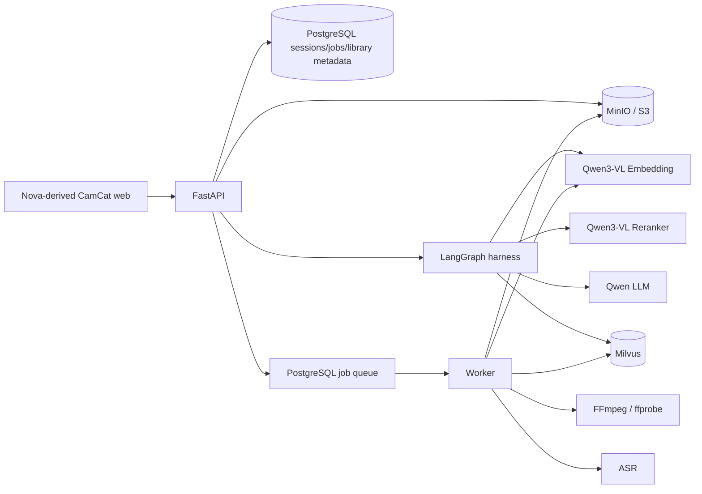

# CamCat architecture



PostgreSQL is authoritative for licensed library metadata, projects, jobs, editing sessions, immutable state versions, patches and audit events. User originals are never `Asset` or `Segment` rows: their temporary MinIO references live only in the four-hour analysis job/session context. One PostgreSQL-advisory-lock maintenance leader deletes the known expired object keys without bucket scans, redacts job payload/results and every state version, and marks the session expired. MinIO's `temporary/` lifecycle rule is the durable deletion backstop, while every local Worker job directory is removed in `finally`.

Jobs use idempotency keys, bounded attempts, exponential backoff, leases and heartbeat renewal. An expired lease is eligible for `SKIP LOCKED` reclaim; an exhausted job becomes `dead_letter`. API cancellation is observed at every progress/checkpoint boundary. Ingestion derives asset and segment UUIDs from licensed provenance and time ranges, overwrites deterministic object keys, publishes Milvus rows only after segment analysis, and removes partial database/vector/object state when its retry budget is exhausted.

## Editing policy

The source-video analyzer uses FFprobe, scene detection, ASR, FFmpeg blur measurement and frame signatures. LangGraph receives these transient source candidates plus supplemental Milvus results. After model planning, a deterministic policy requires source footage, opens on source, removes repeated shots, and trims/drops library clips until `external / total <= 0.25` unless the instruction explicitly raises the limit. The source shape plus platform intent selects 16:9, 9:16, 3:4, 4:3 or 1:1.

Each graph node is emitted as a numbered SSE event and persisted in `graph_runs`; the replay endpoint accepts an event cursor. The final State Patch is written by the graph's explicit `persistence` node and remains atomic and versioned. Metadata-only title/subtitle edits follow a conditional edge that skips material retrieval. `/jobs/{id}` polling remains the recovery source of truth for analysis and render tasks.

## State concurrency

An edit request contains `base_version`. The repository computes and validates the RFC 6902-style patch, then executes a compare-and-swap update:

```sql
UPDATE editing_sessions
SET current_version = :base_version + 1
WHERE id = :id AND current_version = :base_version;
```

Exactly one concurrent writer can update the row. A zero-row update becomes HTTP 409 with expected/current versions and the latest patch metadata. The successful transaction appends `state_versions`, `state_patches`, and an audit event. Rollback computes a compensating patch to a historical document and appends a newer version; history is never deleted.

## Retrieval

The same Qwen3-VL-Embedding-8B model embeds every original video segment and text/image query into a 2048-dimensional MRL space. A separate real direct-video analysis request produces Pydantic-validated scene, action, people, composition, event, tag and risk facts. Dense HNSW, Milvus-native BM25 and scalar/tag/event recall execute independently. CamCat unions by stable segment UUID, applies weighted RRF plus relevance/freshness/compactness signals, and sends only the bounded candidates—with metadata intact—to Qwen3-VL-Reranker-8B. Route scores, ranks, visual facts, license and source URL remain visible in API responses.

## Security modes

`local-single-user` ignores the browser's claimed user ID and binds all records to the configured local owner. `multi-user` accepts identity only from a trusted reverse proxy whose shared secret matches configuration; permanent library ingestion additionally requires an administrator key. User uploads always use the transient endpoint. Nginx provides the same-origin API proxy, request limiting, request-body cap, CSP, MIME-sniffing protection, referrer policy and permissions policy. The API performs container magic checks, FFprobe validation and per-owner quota checks before persistence.
